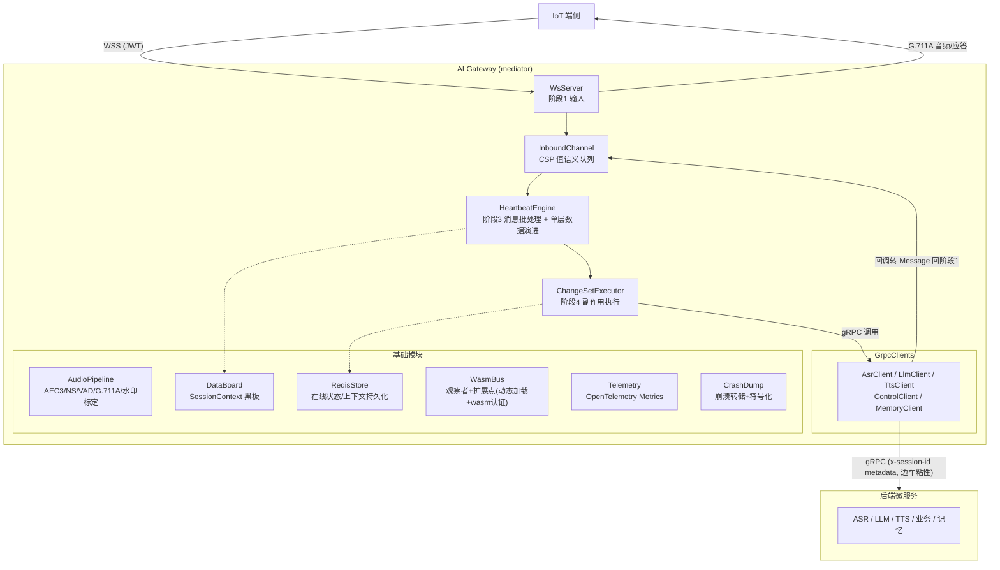
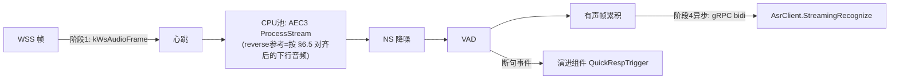
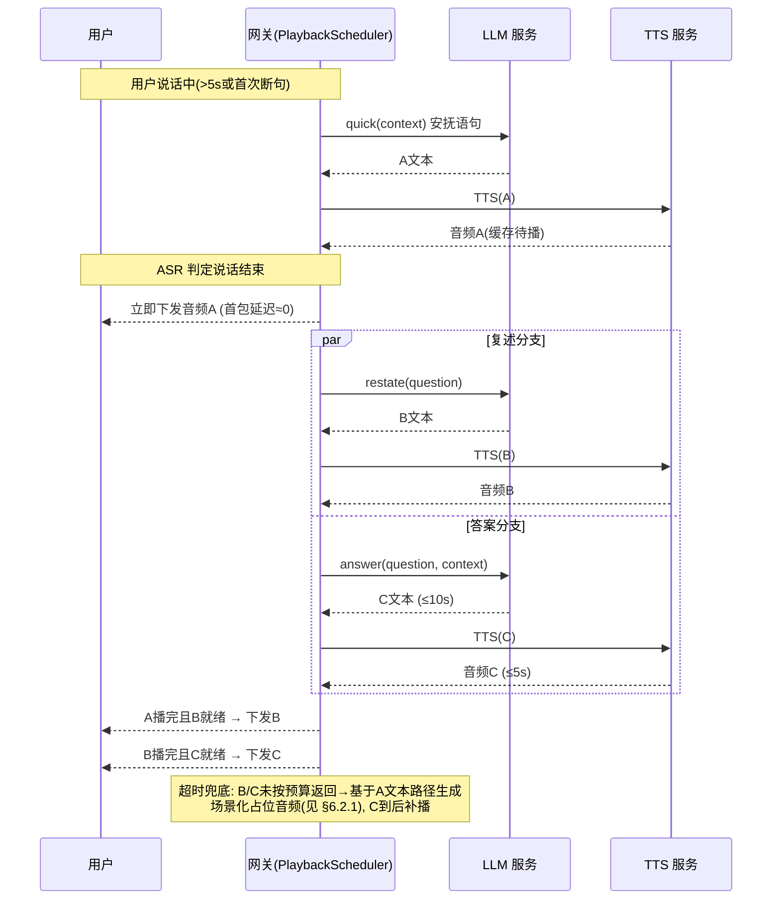
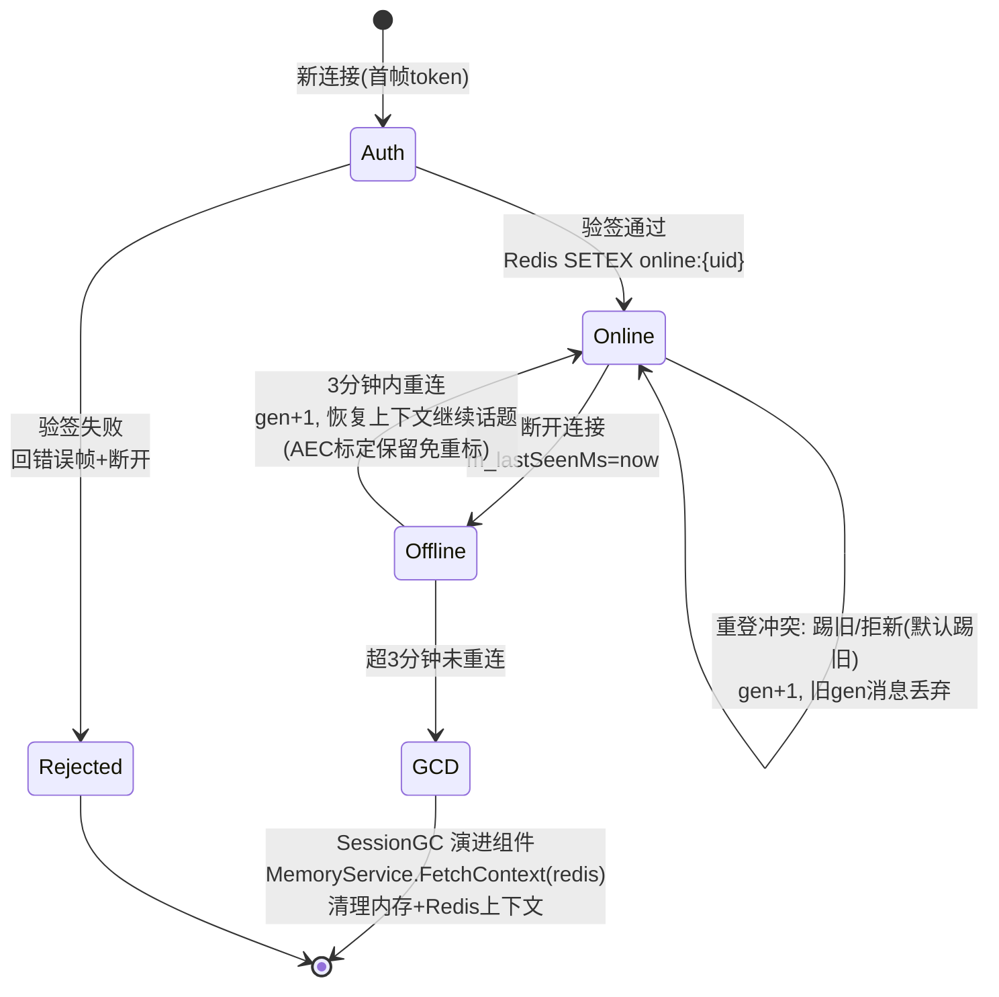
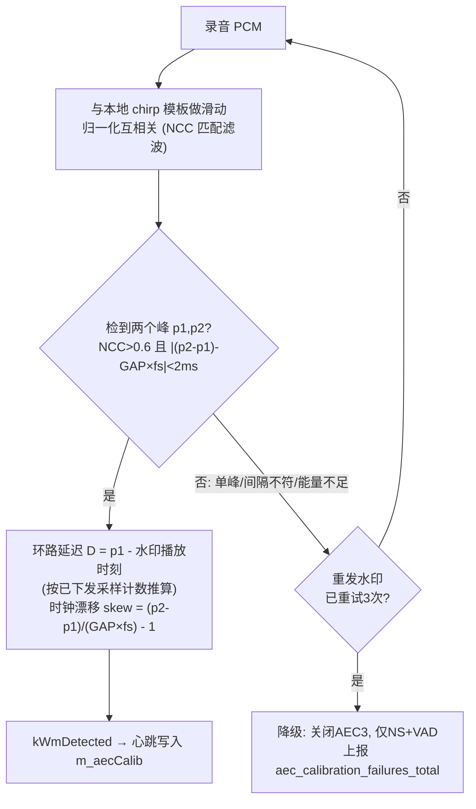
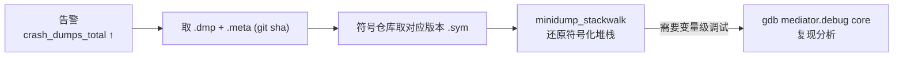

# AI 语音网关（mediator）详细设计文档

> 构建环境：Windows WSL2 (Ubuntu 22.04+) / CMake / C++20
> 架构遵循 reactive-message-framework Skill（四阶段 + 双轨驱动 + 黑板 + CSP Channel）

---

## 1. 总体架构

### 1.1 进程内模块图



### 1.2 四阶段映射

| 阶段 | 职责 | 本系统实现 |
|------|------|-----------|
| 1 外部输入 | WSS 音频帧/控制指令到达、gRPC 回调完成、定时器到期、Redis 事件 | 全部转换为纯值 `Message` 投入 `InboundChannel` |
| 2 消息传递 | 轻量处理 | 音频帧仅入队；**不做** AEC/VAD（重活放心跳内任务分发到 CPU 池） |
| 3 心跳批处理 | 批量取出消息 → 处理 → 单层数据演进 → 收集 ChangeSet | `HeartbeatEngine` 固定节拍（默认 20ms，与音频帧长对齐） |
| 4 副作用执行 | 数据变更落盘/写 Redis、发起 gRPC 调用、回写 WebSocket、产生新消息 | `ChangeSetExecutor` 异步执行，gRPC 回调完成后转 Message 回到阶段 1 |

---

## 2. 依赖与技术选型

| 功能 | 选型 | 说明 |
|------|------|------|
| WebSocket | Boost.Beast (Boost 1.83+) | 自带 TLS（WSS）、与 Asio 线程模型契合 |
| gRPC | gRPC 1.60+（C++，异步 CompletionQueue API） | 全异步，不阻塞心跳；metadata 携带 `x-session-id` 供边车粘性路由 |
| 回声消除/降噪/VAD | WebRTC AudioProcessing Module (APM) | **修正说明**：NetEQ 是抗抖动缓冲，不做回声消除；回声消除用 AEC3、降噪用 NS、VAD 用 APM 内置 VAD。渲染参考信号对齐采用"双音水印标定法"（见 §6.5） |
| G.711A 编码 | 内置查表实现（~200 行） | 无需外部库，16kHz PCM16 → G.711A |
| Redis | hiredis + 自封装异步层 | 在线状态、上下文、会话粘性 |
| JWT | jwt-cpp | HS256/RS256 验签，密钥走配置中心 |
| wasm 扩展 | Wasmtime C API（或 WAMR） | 消息处理扩展沙箱，支持运行时动态加载/卸载/热更新 |
| 可观测性 | opentelemetry-cpp（OTLP gRPC exporter + Prometheus exporter） | Metrics 上报，对接 Collector/Prometheus |
| 崩溃调试 | Google Breakpad（minidump）+ libunwind + addr2line/llvm-symbolizer | 崩溃转储、符号表解析、线上 coredump 调试 |
| 日志 | spdlog | 任务 ID、耗时打点 |
| 测试 | GoogleTest + 自研 E2E 工具 | 见 §9 |
| 构建 | CMake 3.26 + Ninja，vcpkg(manifest) 管理依赖 | WSL Ubuntu |

---

## 3. 线程模型

### 3.1 线程池划分

| 池 | 线程数 | 职责 | 慢任务阈值 |
|----|--------|------|-----------|
| IO 池（Asio） | 2 × CPU 核 | WSS 收发、定时器、Redis IO | > 1s WARN |
| gRPC CQ 池 | 2 | 轮询 CompletionQueue，把完成的 RPC 结果转 Message | > 1s WARN |
| CPU 池-音频 | 1.5 × CPU 核（绑核可选） | AEC/NS/VAD、G.711 编码、水印检测 | > 10ms WARN |
| 心跳线程 | 1（专属） | `HeartbeatEngine` 单线程跑阶段3，**共享数据唯一写者** | 心跳超 20ms WARN |
| wasm 池 | 1~2 | wasm 扩展执行（隔离故障） | > 50ms WARN |

### 3.2 Reactor 调度器

- `Reactor` = 优先级队列定时器 + IO/CPU 阻塞队列 + Task 对象。
- 每个 Task：自增 `task_id` + 任务名（缺省取函数符号名）+ 执行耗时统计。
- 定时任务因繁忙延迟 > 1s 且标记 `skippable` 时跳过本次（仅限巡检类，如"过期会话扫描"）；**消息处理永不跳过**。
- 定时任务不携带业务数据，只触发"去黑板查"的动作。

### 3.3 关键线程安全规则

- `SessionContext` 等共享数据**只允许心跳线程写**；其他线程（如 CQ 池）只读快照或通过 Message 传递。
- 音频原始帧是私有数据：入队即深拷贝，消费线程独占。
- 禁止持锁调用 gRPC/Redis/睡眠。

---

## 4. 消息契约（阶段间类型）

### 4.1 Message（纯值类型）

```cpp
enum class MsgType : uint16_t {
    // 阶段1 外部输入
    kWsAudioFrame,        // 端侧上行音频帧
    kWsControlCmd,        // 端侧控制指令
    kWsConnected, kWsDisconnected,
    // gRPC 回调（阶段4→1 闭环）
    kAsrPartial, kAsrFinal,       // ASR 中间/最终结果
    kLlmQuickResp,                // 快速语句（音频A文本）
    kLlmRestate,                  // 复述（音频B文本）
    kLlmFinalAnswer,              // 最终答案（音频C文本）
    kTtsAudioChunk,               // TTS PCM 块（带 clip_id: A/B/C）
    kControlAck, kMemoryAck,
    // 内部事件
    kWmDetected,                  // 水印检测完成（携带 D/skew）
    // 内部定时巡检（skippable）
    kTickSessionGC, kTickRedisSync, kTickMetrics, kTickAecRecal,
};

struct Message {
    uint64_t    msg_id;
    MsgType     type;
    SessionId   session_id;      // 16 字节值类型，由 JWT 的 uid claim 派生（FNV-1a 双哈希），见 §8
    int64_t     ts_ms;           // 注入时钟的时间戳
    ClipId      clip_id = 0;     // A/B/C 音频归属，0=无
    std::string text;            // 文本载荷
    std::vector<uint8_t> payload;// 二进制载荷（PCM/G711）
    // 不允许任何指针成员
};
```

### 4.2 ChangeSet（阶段3→4）

```cpp
struct ChangeSet {
    std::vector<BoardMutation>  board_writes;   // 黑板数据变更
    std::vector<GrpcCall>       grpc_calls;     // {service, method, request_bytes, session_id}
    std::vector<WsOutbound>     ws_sends;       // {session_id, bytes}
    std::vector<RedisOp>        redis_ops;      // {SETEX/DEL/GET...}
    std::vector<Message>        new_messages;   // 进入下一心跳
};
```

---

## 5. 数据黑板（DataBoard）

### 5.1 数据区划分

| 数据对象 | 锁 | 写者 | 说明 |
|----------|-----|------|------|
| `SessionContext`（每会话一个） | 独立 mutex | 仅心跳线程 | 见 §5.2 |
| `OnlineRegistry` | 读写锁 | 心跳线程 | session_id → 连接代际号，防重登 |
| `Metrics` | 原子变量 | 各线程 | 队列深度、心跳耗时、RPC 时延（镜像到 OTel） |
| `AudioA_Cache` | 每会话锁 | 心跳线程 | 预生成安抚音频的 G.711A 缓冲 |

黑板快照 `Snapshot()` 供测试断言与监控导出。

### 5.2 SessionContext

```cpp
struct SessionContext {
    SessionId    m_sessionId;
    uint64_t     m_connGeneration;   // 重连代际：旧连接来的消息代际不符即丢弃
    SessionState m_state;            // Idle / Listening / Thinking / Speaking
    // 上行音频流水线
    std::deque<PCMFrame> m_pendingFrames;
    int64_t   m_uttStartMs;          // 当前语句起点
    int64_t   m_lastVoiceMs;         // 最近有声时刻
    bool      m_vadEndpoint;         // VAD 断句标记
    bool      m_quickRespSubmitted;  // 音频A是否已请求
    // AEC 标定（§6.5）
    struct { bool valid; int32_t delaySamples; double skew; } m_aecCalib;
    // 下行播放队列
    PlayQueue m_playQueue;           // WM/A→B→C 顺序，每 clip 分块
    ClipId    m_nextClipSeq;
    // 上下文（存 Redis，内存为热缓存）
    std::string m_chatCtx;           // ≤1MB
    int64_t   m_lastSeenMs;          // GC 依据：3 分钟
};
```

### 5.3 单层数据演进（EvolveOnce）

每轮心跳消息批处理完后，演进组件只扫描本轮 `m_changed` 集合，触发一次动作，新变更留待下轮：

| 演进组件 | 条件 | 动作 |
|----------|------|------|
| QuickRespTrigger | 说话时长 > 5s 或首次 VAD/ASR 断句，且未提交 | 发 `GrpcCall.LLM(quick)` |
| PlaybackScheduler | playQueue 首 clip 有数据且端侧可播 | 发 `WsOutbound` 音频块 |
| SessionGC | `now - m_lastSeenMs > 180s` 且无连接 | 发 `GrpcCall.Memory(forget)` + `RedisOp.DEL` + 移除上下文 |
| CtxEvict | `m_chatCtx > 1MB` | 截掉最早对话至 50%，写 Redis |

---

## 6. 关键业务流程

### 6.1 上行（说话 → ASR）



### 6.2 三段式响应（A/B/C 流水线）

**触发点1 — 用户仍在说**（>5s 或首次断句）：
- 提交 `LLM.quick(context)` → 得安抚型文本（"明白，我想一想…"）→ `TTS(A)` → G.711A → 缓存为 **音频A**

**触发点2 — ASR 判定说话结束**（`kAsrFinal` + 语义完整）：
- 并行提交两个 LLM 调用：
  - `LLM.restate(question)` → 复述文本 → `TTS(B)` → **音频B**
  - `LLM.answer(question, context)` → 完整答案 → `TTS(C)` → **音频C**
- 生成时三种文本统一 prompt 约束：A 情绪承接、B 复述开头、C 直奔答案，拼接后像一个回答。

**下发时序**（PlaybackScheduler 演进组件保证严格顺序）：

时延预算：A 争取时间，B 再争取，C 需在 ~10s LLM + ~5s TTS 内完成。

#### 6.2.1 超时兜底：场景化占位音频

**不使用预制提示音**。当 B 或 C 未在预算内返回时，占位音频**走与音频 A 相同的生成路径**（`LLM.quick` → TTS），保证语气、音色、上下文风格与 A/B/C 一致，听起来是同一个回答的自然延续：

- **生成方式**：提交 `LLM.quick(context, reason=wait_placeholder)`，prompt 约束为"符合当前对话场景与情绪的等待占位语句"——由大模型根据**当前上下文**生成，而非固定文案，因此天然适配各种场景：
  - 用户问了复杂技术问题 → "这个问题涉及的点比较多，我梳理一下几个关键部分"
  - 闲聊/情绪场景 → "嗯嗯，我在呢，让我想想看怎么说比较好"
  - 控制类指令 → "好的，正在处理你的请求"
- **要求**：占位文本必须语义中性、不承诺具体结论、可自然衔接后续 B/C（与 A/B/C 的 prompt 约束同族，见 §6.2）。
- **触发与预算**：`clip_pipeline_total{clip, result=timeout}` 计时；B 超时阈值默认 8s、C 超时阈值默认 15s（可配）。超时即发 `GrpcCall.LLM(quick_placeholder)` → `TTS(P)`，P 插入播放队列当前位置；P 播完若正主仍未到，可再生成一条（最多 2 条，之后静音等待并上报 `clip_stalled_total`）。
- **A 未就绪时的回退**：若需要占位时 A 文本尚未生成完毕（连生成占位所依赖的 quick 路径上下文都不可用，或 LLM 暂不可达），则**直接复用上一次对话的占位音频**：
  - 每次生成的占位音频 P（G.711A，≤20s）持久缓存在 `SessionContext.m_lastPlaceholder`，并写 Redis（`placeholder:{uid}`，EX 24h），跨断线重连仍可用；
  - 复用时直接进播放队列，时延 ≈ 0，无需 LLM/TTS；
  - 会话历史上从未产生过占位音频（首轮即超时）→ 最终兜底：立即补发 `LLM.quick(placeholder)` 并静音等待（不上预制音，保持"同一声音"原则）；
  - 复用计数上报 `placeholder_reused_total`。
- **去重**：正主（B/C）到达时若 P 尚未开播则直接丢弃 P，避免重复语义。
- **指标**：`placeholder_generated_total{for_clip=B/C, round}`、`placeholder_generation_latency_ms`。

### 6.3 控制指令

`kWsControlCmd` → 心跳路由 → `GrpcCall.Business(control)`，带 `x-session-id`；响应 `kControlAck` → 回写 WSS。

### 6.4 连接生命周期



### 6.5 AEC3 参考信号对齐：双音水印标定法

**问题**：AEC3 要求 `ProcessStream(capture)` 与 `ProcessReverseStream(render)` 的参考信号严格对齐。本架构音频经 WSS 往返端侧，放音时钟（端侧 DAC）与录音时钟（端侧 ADC）相互独立，存在未知环路延迟与时钟漂移；网关侧无法直接用系统时间对齐，导致 AEC 收敛差甚至发散。

**方案**：会话开始录音时，网关在下行的首个音频流前注入**固定波形的双音水印**（两声、固定间隔），端侧正常播放；随后在录回来的 PCM 中识别该水印，推算环路延迟与漂移。

#### 6.5.1 水印信号设计

- 波形：两段 **Chirp 扫频音**（如 1kHz→4kHz，各 20ms），间隔固定 `GAP_MS`（默认 320ms）。选 Chirp 而非单音：宽带信号互相关峰尖锐，抗扬声器失真与环境噪声，峰值检测信噪比高。**间隔长度决定 skew 测量精度**（分辨率 ≈ 1/间隔采样数）：320ms@16kHz=5120 采样，配合抛物线亚采样插值可达 <20ppm；80ms 间隔物理上无法达到该精度。
- 峰值提取：全量滑动 NCC → 局部最大值 + 非极大抑制 → **抛物线插值亚采样峰位**（200ppm 漂移在间隔上不足 1 个采样，必须亚采样）。
- 生成：离线生成固定 PCM 模板编译进二进制资源，全会话复用；幅度 -6dBFS 防削波。
- 注入时机：`WsConnected` 且首次开始上行录音前，由 PlaybackScheduler 在下行队列头部插入水印 clip（`ClipId = WM`，不占用 A/B/C 序号）。**水印播放期间（含检测完成前）上行语音帧直接丢弃，不做识别、不送 ASR**；丢弃帧计数上报 `audio_frames_dropped_total{reason="wm_calib"}`。
- 水印同样流经 G.711A 通路：检测端用"经 G.711A 编解码后的模板"做相关，避免编解码失真导致相关峰衰减。

#### 6.5.2 检测算法（上行 PCM 中识别水印）



- 检测在 CPU 池-音频执行，20ms 帧滑窗增量相关（无需全量 FFT）；检测成功后发 `kWmDetected` Message 进心跳。
- 端侧若已知自身 play/capture 硬件延迟，可通过协议预留字段上报，进一步精修 D。

#### 6.5.3 对齐与重采样

- 心跳将 `{D, skew}` 写入 `SessionContext.m_aecCalib`。
- 下行回灌 reverse stream 前按 `D` 做延迟补偿（环形缓冲对齐）；按 `skew` 做**异步重采样**（线性插值即可，典型漂移 < 500ppm），使 render 参考与 capture 时钟一致后再喂 `ProcessReverseStream`。
- **漂移跟踪**：会话中每 60s（skippable 定时任务 `kTickAecRecal`）读取 AEC3 延迟估计（`GetDelayMetrics`）复核；漂移超阈值则插入微型水印重标定。重标定任务可跳过，消息处理不可跳过（§3.2）。

#### 6.5.4 测试

- 单元：合成"模板 chirp + 已知延迟 + 已知 skew（±200ppm）+ 白噪声/模拟回声"的 PCM，断言检测器输出 D 误差 < 1ms、skew 误差 < 20ppm；负例（无水印、单峰、错误间隔、经过 G.711A 失真）不误检。
- E2E：mock 端侧人为注入固定 drift 的回放回路，断言标定成功且 AEC 收敛（ERLE 改善），连续 3 次失败时降级路径正确触发。

---

## 7. 扩展性：观察者 + wasm 动态加载

### 7.1 观察者接口

- **消息总线观察者**：`WasmBus.Subscribe(MsgType, Observer)`；心跳内消息批处理时同步派发给观察者（wasm 沙箱内执行，超时熔断）。
- **wasm 扩展注册**：扩展模块导出 `on_message(msg_view) -> [action]`，action 只能是"发新消息/写私有数据区"，不能直接做 IO —— 保持四阶段契约不被穿透。
- 内置扩展点示例：敏感词过滤、说话人画像更新、自定义控制指令。

### 7.2 wasm 动态加载（WasmModuleManager）

- **加载来源**：本地目录 `extensions/`（inotify 监听变更）、Redis 发布订阅通道推送（`PUBLISH wasm:reload <name>`）、管理 RPC `ReloadExtension(name, bytes)`。
- **版本化实例管理**：
  - 每个扩展 = `{name, version, wasm_bytes, Wasmtime::Module, 订阅表}`，按名称维护**双实例（current/next）**。
  - 新版本编译（`Module::new`）成功后置为 next；在**心跳边界**原子切换（心跳内不切换，保证单轮语义一致），旧版本进入 draining，引用计数归零后卸载。
  - 编译/校验失败：拒绝切换，保留旧版本，上报 metric `wasm_reload_failures_total` 并告警。
- **资源隔离**：每个 wasm 实例配置 fuel（指令燃料）上限 + 内存上限 + 单次调用超时（默认 5ms，超限 `wasm_trap_total` 计数并熔断该实例 30s）。
- **ABI 契约**：宿主提供 `host_get_blackboard_view / host_emit_message` 两个 import；扩展内存通过线性内存拷贝交互，**禁止指针逃逸**（与 CSP 值语义一致）。
- **确定性**：wasm 内禁止访问真实时钟/随机数，时间由宿主注入；保证 §9.1 确定性重放不被破坏。
- **测试**：mock 一个"计数器扩展"，验证加载→订阅生效→热更新切换→旧实例 draining→熔断全链路。

### 7.3 wasm 安全验证扩展（可插拔认证）

认证逻辑做成**可替换扩展点**：内置 JWT 验证是默认实现，外部验证方式（企业 SSO、HMAC 设备签名、自定义 token 格式等）以 wasm 扩展注入，**通过启动参数激活**，无需改主代码。

#### 7.3.1 启动参数配置

```
--auth-provider=builtin              # 默认：内置 jwt-cpp HS256/RS256
--auth-provider=wasm:<name>          # 激活 extensions/<name>.wasm 作为认证提供者
--auth-provider=wasm:<name>:fallback=builtin   # wasm 失败时回退内置(默认 fail-closed 不回退)
--auth-wasm-timeout-ms=20            # wasm 认证调用超时(默认20ms)
--auth-wasm-max-fuel=1000000         # 单次认证指令燃料上限
```

- 启动时校验：指定 `wasm:<name>` 但模块缺失/编译失败 → **进程拒绝启动**（认证不可用不允许带病运行），日志+退出码非零。
- 支持 §7.2 的热更新：认证扩展可在心跳边界换新版本，draining 期间旧实例继续服务。

#### 7.3.2 认证 ABI 契约

```c
// wasm 扩展必须导出:
// 输入: 连接首帧的原始 token 字节 + 对端信息(IP/UA), 宿主注入当前时间
// 输出: AuthResult { allow: bool, uid_len+uid[], ttl_s, deny_reason[] }
// 说明: 不单独返回 session_id —— session_id 即 uid（宿主统一由 uid 派生 16 字节 SessionId），
//       wasm 扩展与内置 JWT 路径产出的 uid 语义完全一致
int32_t auth_verify(int32_t req_ptr, int32_t req_len);
```

- 宿主侧 `AuthProvider` 抽象接口：`AuthResult Verify(const AuthRequest&)`，两个实现：`BuiltinJwtAuth`（jwt-cpp）与 `WasmAuth`（经 WasmModuleManager 调用导出函数）。`main.cpp` 按启动参数装配，业务代码只面向 `AuthProvider`。
- **Fail-closed**：wasm 调用超时/trap/fuel 耗尽一律视为拒绝（`deny_reason="auth_internal"`），计 `auth_wasm_failures_total`；连续失败超阈值熔断该扩展（§7.2），熔断期全部拒绝（除非配置 `fallback=builtin`）。
- 认证在**阶段1**执行（连接建立时），不走心跳批处理——这是架构特许：认证无共享状态写入，结果只产生 `kWsConnected`/拒绝+断开。
- wasm 扩展返回的 `uid/ttl` 进入 `SessionContext` 与 `OnlineRegistry`，与内置 JWT 路径完全同构（内置路径直接从 JWT 的 uid claim 取）。
- wasm 内禁止网络/文件 IO（无 WASI 能力授予），需要外部数据验证的（如查吊销列表）由宿主定期把数据快照通过 import 推入（`host_auth_get_revocation_view`），保持沙箱纯净。

#### 7.3.3 测试

**单元测试（GoogleTest）**：
- `test-wasm/auth_allow.wasm` / `auth_deny.wasm` / `auth_trap.wasm` / `auth_slow.wasm` 四个测试扩展（WAT 编译）：
  - allow → 返回合法 AuthResult，断言 session_id 透传进 SessionContext；
  - deny → 断言连接收到错误帧并断开，`ws_auth_failures_total{reason="wasm_deny"}` +1；
  - trap / 超时（slow 配 1ms 超时）→ fail-closed 拒绝 + `auth_wasm_failures_total` +1 + 熔断计数；
  - 配置 `fallback=builtin` 后 trap → 回退内置 JWT 验证；
  - 启动参数指定缺失模块 → 进程装配失败（装配函数返回错误）。
- 热更新：allow v1 → 热切 deny v2 → 心跳边界后新连接被拒，旧连接（已认证）不受影响。

**端到端测试（tools/e2e_client）**：
- 网关以 `--auth-provider=wasm:e2e_auth` 启动（e2e_auth.wasm：只接受 magic token `"wasm-ok"`）；
- E2E 断言：错误 token → 收错误帧+断开；`"wasm-ok"` → 完成握手 → 走通"发音频→收A/B/C→控制指令→断线重连"全链路（证明 wasm 认证产出的 session 与内置路径等价）；
- 运行中 `PUBLISH wasm:reload e2e_auth` 热更改为只接受 `"wasm-ok-v2"` → 旧 token 新连接被拒，新 token 通过。

**指标**：`ws_auth_failures_total{provider,reason}`、`auth_wasm_failures_total{ext_name}`、`auth_verify_duration_ms{provider}` Histogram。

---

## 7A. 可观测性：OpenTelemetry Metrics

### 7A.1 接入方式

- SDK：`opentelemetry-cpp`，初始化 `MeterProvider`，双 exporter：
  - **OTLP gRPC exporter** → OpenTelemetry Collector（生产主路径，可配 endpoint/tls/compression）。
  - **Prometheus exporter** → 进程内 `/metrics` HTTP 端点（便于本地与兜底抓取）。
- 资源标签：`service.name=mediator`、`service.version`、`gw_instance_id`。
- 统一封装 `Telemetry` 单例，所有指标经它注册，**禁止业务代码直接依赖 OTel API**（便于测试期替换为 `NoopMeter`）。
- 低开销：指标更新为原子累加，导出异步批量（默认 10s 间隔）；心跳线程只做 `Add/Record`，不做任何 IO。

### 7A.2 指标清单

| 指标名 | 类型 | 标签 | 说明 |
|--------|------|------|------|
| `ws_connections_active` | UpDownCounter | state | 当前在线连接数 |
| `ws_auth_failures_total` | Counter | reason | JWT 验签失败 |
| `inbound_queue_depth` | ObservableGauge | - | 阶段1→2 队列深度（压力感知输入） |
| `heartbeat_duration_ms` | Histogram | - | 心跳耗时，>20ms 触发 WARN |
| `heartbeat_batch_size` | Histogram | - | 每批消息数 |
| `audio_frames_processed_total` | Counter | direction | 上/下行帧数 |
| `asr_stream_latency_ms` | Histogram | - | 帧发送到 partial 返回时延 |
| `grpc_call_duration_ms` | Histogram | service, method, code | 全 RPC 时延（ASR/LLM/TTS/…） |
| `tts_first_chunk_latency_ms` | Histogram | clip(A/B/C) | **首音频时延核心 SLI** |
| `clip_pipeline_total` | Counter | clip, result(ok/timeout) | A/B/C 流水线成败 |
| `placeholder_generated_total` | Counter | for_clip, round | 场景化占位音频生成次数 |
| `placeholder_reused_total` | Counter | - | 复用上一次占位音频次数 |
| `placeholder_generation_latency_ms` | Histogram | - | 占位音频生成时延 |
| `clip_stalled_total` | Counter | clip | 占位两轮后仍未就绪 |
| `audio_frames_dropped_total` | Counter | reason | 上行丢帧（如水印标定期） |
| `aec_calibration_failures_total` | Counter | reason | 水印标定失败/降级 |
| `aec_drift_ppm` | ObservableGauge | - | 当前会话时钟漂移中位数 |
| `session_gc_total` | Counter | - | 超期会话清理数 |
| `session_reconnect_total` | Counter | within_3min | 断线重连统计 |
| `wasm_invocations_total` / `wasm_trap_total` / `wasm_reload_failures_total` | Counter | ext_name | wasm 运行/熔断/热更失败 |
| `task_slow_total` | Counter | pool, task_name | 慢任务告警计数 |
| `redis_op_duration_ms` | Histogram | op | Redis 时延 |
| `crash_dumps_total` | Counter | signal | 崩溃转储次数（重启后补报） |

### 7A.3 与压力感知联动

`inbound_queue_depth`、`heartbeat_duration_ms` 同时喂给自适应保护回路：超阈值 → 跳过 skippable 定时任务 → 低优先级输入准入控制；保护触发本身也上报 `overload_protection_active` Gauge。

---

## 7B. 崩溃调试：Dump 与符号表

### 7B.1 转储方案

- **主路径：Google Breakpad**。进程启动时注册 `ExceptionHandler`，崩溃时在信号处理上下文生成 **minidump**（`.dmp`，含线程栈/寄存器/模块列表）写入 `/var/crash/mediator/`，同时写一个 `.meta`（版本、git sha、实例 ID）。
- **兜底：coredump**。WSL/容器内配置 `ulimit -c unlimited` + `kernel.core_pattern`，breakpad 未覆盖的场景（如启动早期崩溃）由系统 core 兜底。
- 崩溃后由**外部 watchdog 进程**（不走崩溃进程自身）负责：压缩归档 dump、按 retention（默认保留最近 20 份）清理、可配上送对象存储。崩溃进程内只做最小异步信号安全操作。
- `crash_dumps_total` 在下次启动时扫描 dump 目录补报。

### 7B.2 符号表管理

- **构建流水线**（CMake 自定义 target `symbols`）：
  1. Release 构建带 `-g`（`-g` 不影响优化，符号与代码分离）。
  2. `objcopy --only-keep-debug mediator mediator.debug` 抽出调试符号；
     `strip --strip-debug --add-gnu-debuglink=mediator.debug mediator` 主二进制瘦身并保留 debuglink（build-id 关联）。
  3. `dump_syms mediator.debug > mediator.sym` 生成 Breakpad 文本符号，按 `<module>/<build_id>/mediator.sym` 目录结构入**符号仓库**（版本化存储，与 git sha 一一对应）。
- **符号化工具链**：
  - 线上 dump：`minidump_stackwalk crash.dmp symbols/` → 带函数名/行号的堆栈。
  - 手工/CI：`llvm-symbolizer --obj=mediator.debug <addr>` 或 `addr2line -e mediator.debug -f -C <addr>` 解析单地址。
- **运行时辅助**（非崩溃路径）：`backward-cpp`（libunwind + libdw）在 FATAL 日志/断言失败时打印**已符号化**的当前堆栈，便于活体诊断；此路径不打断 §3 线程规则（仅在致命错误时使用）。

### 7B.3 调试工作流



---

## 8. 安全设计

| 项 | 方案 |
|----|------|
| 传输 | WSS（TLS 1.3），内网 gRPC 可 plaintext+mTLS 可配 |
| 认证 | 连接首帧 JWT，HS256 验签，过期/错签 → `ErrorMsg` 帧 → 关闭；**session_id 取自 JWT 的 uid claim**（16 字节 SessionId = FNV-1a(uid) 双哈希，全链路、gRPC `x-session-id`、Redis key 均以此为准） |
| 防重登 | `OnlineRegistry` + Redis `SET online:{uid} NX EX`，冲突按策略踢旧/拒新；gen 代际号防旧连接消息污染 |
| 上下文 | Redis 单会话 ≤1MB，超限淘汰最早对话至 50% |
| RPC 粘性 | 所有 gRPC metadata 带 `x-session-id`，边车一致性哈希路由 |
| 审计 | 慢任务 WARN、鉴权失败、GC 事件结构化日志 |

---

## 9. 可测试性与测试计划

### 9.1 测试钩子（Skill 强制项）

- `IClock` 注入：生产用 `SteadyClock`，测试用 `VirtualClock::Advance(ms)`。
- `InboundChannel::Inject(msg)`、`DataBoard::Inject(session, ctx)`：测试直接构造场景。
- `HeartbeatEngine::RunOnce()`：手动单步心跳，返回本轮 `ChangeSet` 供断言。
- 确定性：同一初始黑板 + 同一消息批 → 相同 ChangeSet（禁随机数/真实时钟泄漏，wasm 扩展同样受约束）。

### 9.2 mock 服务（极简 gRPC server）

`tools/mock_services/` 下实现 5 个进程（或单进程多服务）：ASR/LLM/TTS/Business/Memory，行为由脚本驱动：
- ASR mock：收到 N 帧后回 partial，结束标记后回 final。
- LLM mock：按方法名回固定文本（quick/restate/answer 各一句）。
- TTS mock：文本 → 生成正弦波 PCM（长度 ∝ 字数），验证 A/B/C 时长预算。

### 9.3 测试用例（GoogleTest）

| 层 | 用例 |
|----|------|
| 单元 | G.711A 编解码往返；JWT 验签正/反例；CSP Channel 深拷贝语义；定时器跳过策略；1MB 上下文淘汰算法；水印检测精度/负例（§6.5.4）；Telemetry NoopMeter 替换后指标断言；符号化工具链（构造已知地址→llvm-symbolizer 解析正确） |
| 心跳 | 同批消息确定性重放；演进单层性（演进产生的变更本轮不触发）；QuickResp 三触发条件（5s/VAD/ASR断句）各命中一次 |
| 会话 | 断线 3min 内重连恢复（含 m_aecCalib 保留免重标）；3min 后 GC 且 MemoryClient 被调用；重登踢旧连接后旧 gen 消息被丢弃 |
| E2E | `tools/e2e_client`（C++）：模拟端侧"播放wav→收A/B/C→断言顺序与首包时延 < 200ms→发控制指令→断言ack→断线重连续聊"全链路 |

通过标准：`ctest` 全绿 + E2E 全绿。

---

## 10. 工程结构（WSL）

```
mediator/
├── CMakeLists.txt / vcpkg.json
├── proto/                  # asr.proto llm.proto tts.proto business.proto memory.proto
├── src/
│   ├── core/               # reactor/ timer/ channel/ task/ clock/ (框架层, 无业务)
│   ├── engine/             # heartbeat/ blackboard/ evolve/ changeset/
│   ├── net/                # ws_server(Boost.Beast)/ jwt/ grpc_clients/ session_sticky/
│   ├── audio/              # apm_wrapper(AEC3/NS/VAD)/ watermark(chirp生成+检测)/ align(重采样)/ g711/ play_queue/
│   ├── session/            # session_ctx/ online_registry/ redis_store/ lifecycle/
│   ├── ext/                # wasm_bus/ wasm_module_manager(动态加载)/ observer/
│   ├── telemetry/          # OTel 封装(可替换 NoopMeter)
│   ├── crash/              # breakpad handler/ backward-cpp 堆栈/ watchdog
│   └── main.cpp
├── tests/                  # gtest 单元+心跳测试
└── tools/
    ├── mock_services/      # 5合1 mock gRPC server (脚本化行为)
    └── e2e_client/         # E2E 端侧模拟器
```

### 构建（WSL Ubuntu 22.04）
```bash
sudo apt install -y build-essential cmake ninja-build pkg-config autoconf libtool
git clone https://github.com/microsoft/vcpkg && ./vcpkg/bootstrap-vcpkg.sh
cmake -B build -GNinja -DCMAKE_TOOLCHAIN_FILE=$VCPKG_ROOT/scripts/buildsystems/vcpkg.cmake
cmake --build build && ctest --test-dir build --output-on-failure
cmake --build build --target symbols   # 抽调试符号 + dump_syms 入符号仓库
```

---

## 11. 风险与决策点

1. **NetEQ ≠ 回声消除**：已改用 WebRTC APM（AEC3）。参考信号对齐采用**双音水印标定法**（§6.5）解决跨网络的 render/capture 时钟漂移问题——这仍是最大技术风险点，建议先做 spike：用合成 PCM 验证检测精度，再接入真实端侧验证 ERLE。
2. **gRPC bidi 流与心跳模型**：ASR 流式发送放阶段4异步执行，发送队列积压时做准入控制（丢帧策略：优先丢最早未确认帧，保 VAD 状态连续）。
3. **wasm 选型**：Wasmtime 体积大但生态好；WAMR 轻量。初版可先只落观察者接口，wasm 动态加载作为二期；接口设计已按动态加载预留。
4. **单进程有状态 + Redis**：网关宕机会话内存态丢失，Redis 的 1MB 上下文可恢复话题但播放队列与 AEC 标定不可恢复（重连后重标）——可接受，需在文档声明。
5. **Breakpad vs Crashpad**：Breakpad 成熟但维护放缓；Crashpad 更新但 Linux 集成稍复杂。初版用 Breakpad，接口层隔离便于替换。
